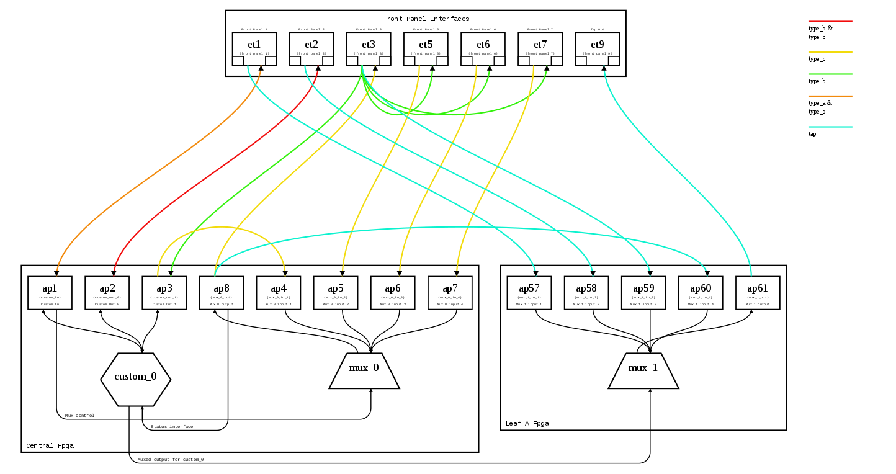

# switch-config-render

switch-config-render is a python module that can be used to create
an SVG depiction of the internal configuration of an FPGA-based network
switch product.

The module renders:
* Front panel interfaces in use, together with their optional alias and
description
* FPGA application interfaces with their optional alias and description
* Applications configured on the FPGA devices and the ports that they
are connected to
* Cross-connect connections between the front panel and application
interfaces which can be colour-coded depending on the connection type(s)
as defined in the interface definitions

Example output:



Install by running `python setup.py install` from the project root
directory.

## Generating an SVG

The SVG can be generated by calling the `generate_system_svg` function:

```python
generate_system_svg('svg_file.svg', interfaces, connections, fpga_devices, device_shapes)
```

Where:
* `svg_file.svg` is the name of the destination .svg file
* `interfaces` is a dict specifying all the front panel and FPGA application
interfaces
* `connections` is a dict of `key: value` pairs, where the `key` defines the
destination and the `value` the source of a connection
* `fpga_devices` is a dict that specifies the application devices that are
configured on the given FPGA
* `device_shapes` defines the vertices of the shapes to be used for the
application device defined in `fpga_devices`

Refer to the example code in `switch_config_render.__main__.py` for more
information.

## Example Application

An example application is provided and can be run by calling:

```bash
python -m switch_config_render
```

from the project root. The example runs `switch_config_render.__main__.py`
which runs two examples: one that calls the high-level
`generate_system_svg` function and one low-level example that manually
creates objects for fine-grained placement control. These examples
produce the `high_level_example.svg` and `low_level_example.svg` files
respectively.


## License

switch-config-render is:

Copyright \[2018\] \[Optiver\]

Licensed under the Apache License, Version 2.0 (the "License");
you may not use this file except in compliance with the License.
You may obtain a copy of the License at

    http://www.apache.org/licenses/LICENSE-2.0

Unless required by applicable law or agreed to in writing, software
distributed under the License is distributed on an "AS IS" BASIS,
WITHOUT WARRANTIES OR CONDITIONS OF ANY KIND, either express or implied.
See the License for the specific language governing permissions and
limitations under the License.
